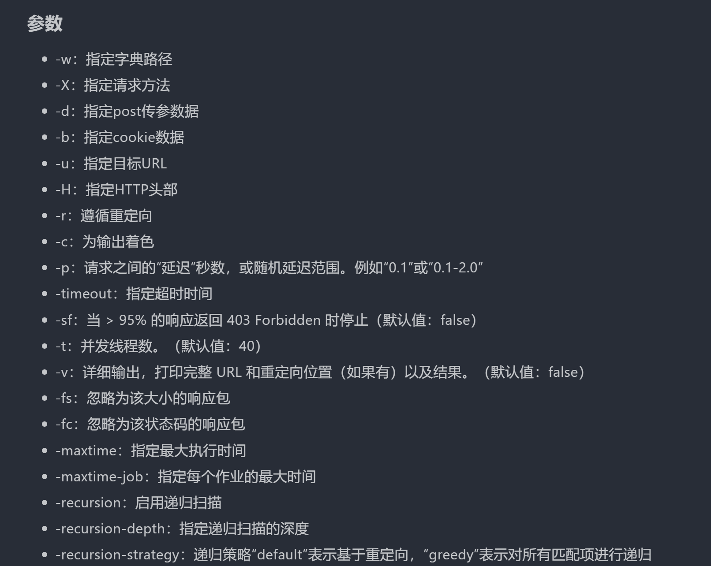
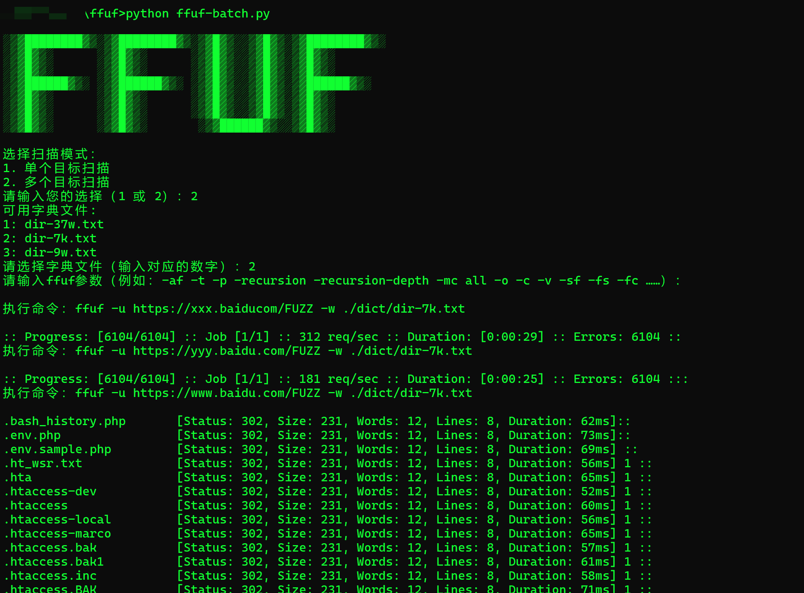
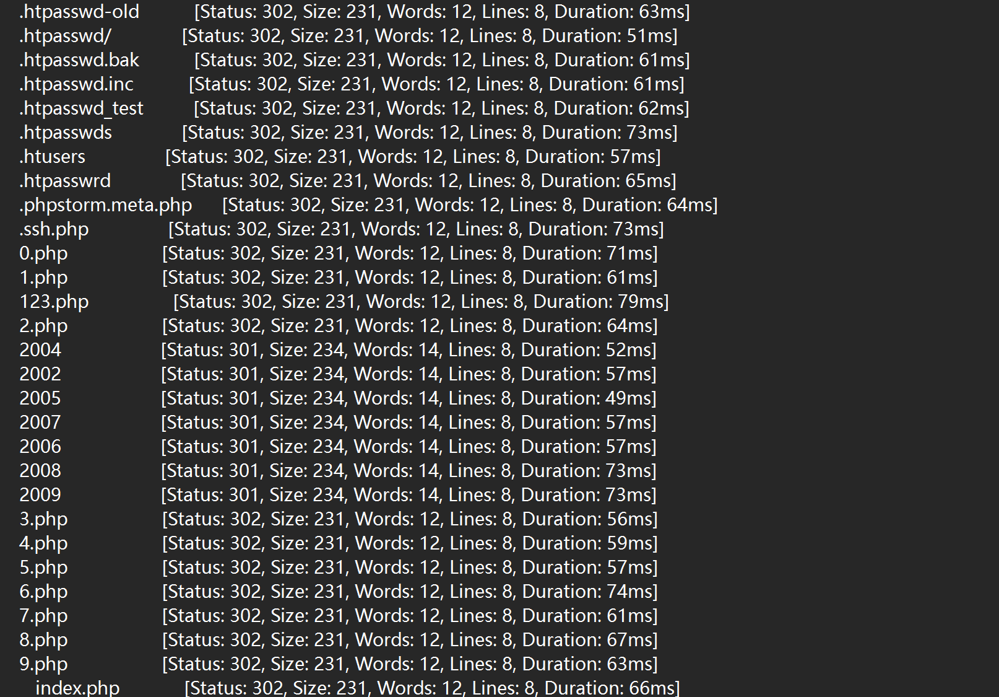
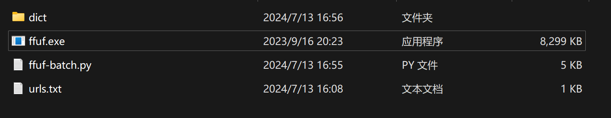

# 调用 FFUF 实现批量的小脚本 FFUF_Batch

## 前言

FFUF是一个用Go语言编写的高速Web模糊测试工具。常被用来FUZZ、目录扫描，因其极快的速度和爆破位置、字典路径十分灵活，几乎成为了FUZZ、目录扫描的不二选择，也是使用量最大的目录扫描工具之一。但是FFUF一次只能对一个url进行目录扫描，不能实现批量扫描，于是就有了这个小脚本的出现。网上其实也有这种类似的小脚本，已经写得非常优秀了，但是不太符合我个人的使用习惯，参数，字典路径方面没有达到我想要的那种灵活与自由，于是还是打算自己写一个。纯小白，第一次写这种小脚本，不懂python，代码基础很差，还望各位大佬轻喷，此小脚本要是能帮到您一点点的话，简直是我的荣幸……

## FFUF

* 官方地址：https://github.com/ffuf/ffuf
* 发新版：https://github.com/ffuf/ffuf/releases/tag/v2.1.0
* 命令使用：https://x1lys.github.io/2024/07/12/FFUF%E7%94%A8%E6%B3%95%E6%89%8B%E5%86%8C/

## 项目截图

* 运行截图（多个目标）

* 输出结果截图

## 项目介绍

其实就是循环调用了ffuf工具，自定义了一些参数接收，字典选择的逻辑，然后拼接参数与路径批量执行ffuf命令，很简单

* dict：提供的默认目录扫描字典，不能重命名，或者需要在代码中修改路径，可自定义
* ffuf.exe：ffuf工具
* ffuf-batch.py：实现批量的小脚本
* urls.txt：提供的url列表，不能重命名，或者需要在代码中修改文件名

## 安装

* 直接下载该项目即可，ffuf已经打包好了，无需再下载ffuf，是2.1.0-windows-amd64版本的

## 使用

### 单个目标

1. 选择1单个目标
2. 选择字典序号，可自定义字典，不支持目录，只支持文件
3. 输入可选ffuf的参数
4. 输入单个目标的url
5. 结果输出在single_target_result.txt

### 多个目标

1. 选择2多个目标
2. 选择字典序号，可自定义字典，不支持目录，只支持文件
3. 输入可选ffuf的参数
4. 自动从urls.txt中读取url扫描
5. 结果输出在multiple_target_result.txt

